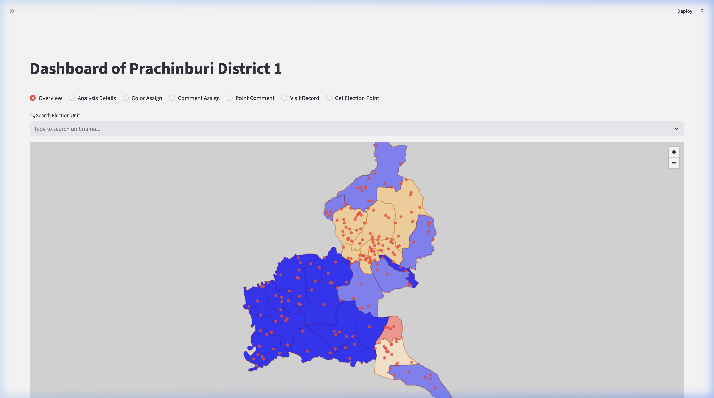
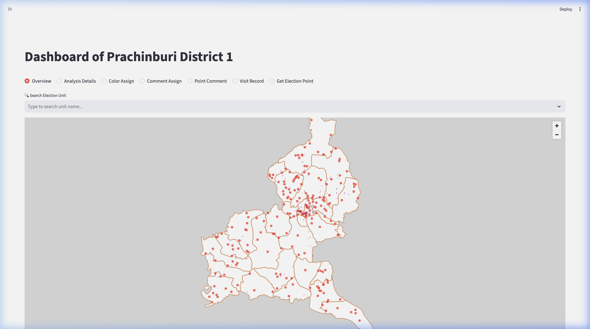
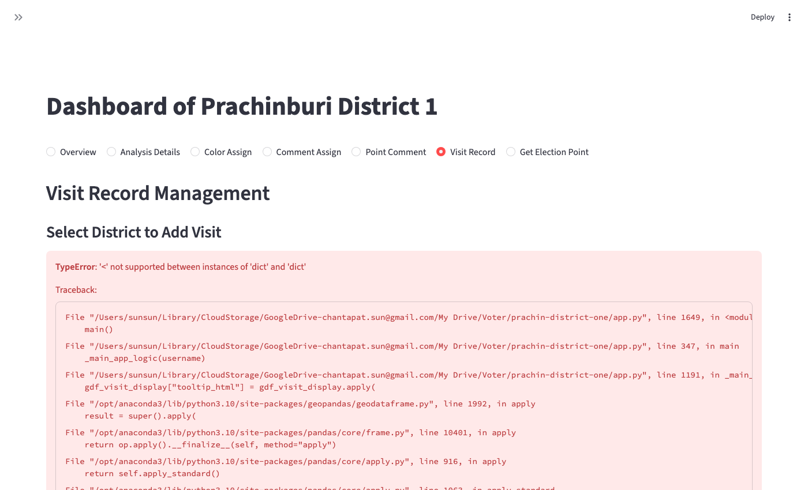

# Prachinburi District 1 Dashboard

[](https://www.python.org/)
[](https://streamlit.io/)
[](LICENSE)

A Streamlit-based dashboard for visualizing election data, managing campaign points, and analyzing voter demographics in Prachinburi District 1 (ปราจีนบุรี เขต 1).


---

## Features

- **Public Read-Only Mode**: A simplified, public-facing map view (`public_app.py`) for sharing district data without exposing admin controls.
- **Interactive Maps**: High-performance visualizations using PyDeck and Folium to display district boundaries, election units, and campaign locations.
- **Layer Management**: Toggle layers including:
  - **Winners**: Visualize election winners by party colors (Bhumjaithai, Move Forward, Pheu Thai).
  - **Points**: Precise locations of election units.
  - **Campaign Pins**: 3D column visualization of campaign poster locations.
  - **Comments**: Geolocation-based comments for field notes.
- **Color Assignment**: Interactive tool to assign colors (Orange, Green, Brown, Blue) to sub-districts for strategic planning.
- **Visit Record**: Track and record visit dates per sub-district.
- **Comment System**: Add, view, and delete comments pinned to specific coordinates or districts.
- **KML Integration**: Upload and visualize custom KML files. Supports Google Cloud Storage (GCS) for persistence.
- **Authentication**: Secure login system to protect sensitive data.

| Map & Winners | Campaign Pins | Visit Records |
|---|---|---|
|  |  |  |

---

## Installation

1. **Clone the repository:**

   ```bash
   git clone https://github.com/sunsunskibiz/prachin-district-one.git
   cd prachin-district-one
   ```

2. **Install dependencies:**

   ```bash
   pip install -r requirements.txt
   ```

3. **Configuration:**
   - Ensure `auth_config.yaml` is present for authentication settings.
   - Place necessary data files (CSV, KML, JSON) in the root or `data/` directory as referenced in `utils/constants.py`.

---

## Usage

### Public App (Read-Only)

```bash
streamlit run public_app.py
```

Access at `http://localhost:8501`.

### Admin Dashboard (Full Access)

```bash
streamlit run app.py
```

Access at `http://localhost:8502` (if configured) or the default port.

---

## Project Structure

```
├── app.py                  # Main authenticated application
├── public_app.py           # Public read-only application
├── utils/                  # Utility modules
│   ├── constants.py        # File paths and configuration constants
│   ├── data_utils.py       # Data loading and processing functions
│   ├── geo_utils.py        # Geospatial operations (polygons, masks)
│   ├── gcs_utils.py        # Google Cloud Storage integration
│   └── html_utils.py       # HTML generation for tooltips (Thai formatting support)
├── auth_config.yaml        # Authentication configuration
├── requirements.txt        # Python dependencies
├── deploy.sh               # Deployment script (admin app)
├── deploy_public.sh        # Deployment script (public app)
├── Dockerfile              # Container configuration
└── README.md               # Project documentation
```

---

## Deployment

The project includes Docker support and deployment scripts:

```bash
# Deploy the public read-only app
./deploy_public.sh

# Deploy the admin dashboard
./deploy.sh
```

---

## Technologies

- **Python 3.9+**
- **Streamlit** — Web framework
- **PyDeck** — WebGL-powered map visualizations
- **Pandas / GeoPandas** — Data manipulation and geospatial analysis
- **Google Cloud Storage** — Persistence layer for KML and data files
- **Docker** — Containerized deployment

---

## License

Distributed under the Apache License 2.0. See [LICENSE](LICENSE) for details.
